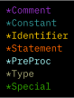

<table>
<tbody align="center">

<tr>

<td colspan="2">

# rdy

###### pronounced “ready”

#### A Vim color scheme for carefully organized code

</td>

<td width="25%"></td>

</tr>

<tr>
<td colspan="3"></td>
</tr>

</tbody>
</table>

## Get rdy

### Installation

In Vim 8+, plugins can be installed by cloning them to
`~/.vim/pack/plugins/start`.

E.g.

<pre>
<code>mkdir -p ~/.vim/pack/plugins/start</code>
<code>cd ~/.vim/pack/plugins/start</code>
<code>git clone https://github.com/haystackandroid/vim-rdy</code>
</pre>

Another option is to place the `start` directory elsewhere and symlink to
`~/.vim/pack/plugins`.

E.g.

<pre>
<code>mkdir -p ~/.vim/pack/plugins</code>
<code>mkdir -p ~/Documents/vim-stuff/start</code>
<code>ln -s ~/Documents/vim-stuff/start ~/.vim/pack/plugins/</code>
<code>cd ~/Documents/vim-stuff/start</code>
<code>git clone https://github.com/haystackandroid/vim-rdy</code>
</pre>

### Activation – vimrc

#### Vim

<pre>
<code>colorscheme rdy</code>
</pre>

#### [vim-airline](https://github.com/vim-airline/vim-airline)

<pre>
<code>let g:airline_theme = 'rdy'</code>
</pre>

#### [lightline.vim](https://github.com/itchyny/lightline.vim)

<pre>
<code>let g:lightline = { 'colorscheme': 'rdy' }</code>
</pre>

#### Terminal Vim

For accurate colors (which require a terminal with [true-color
support](https://github.com/termstandard/colors#truecolor-support-in-output-devices)):

<pre>
<code>set termguicolors</code>
</pre>

Some terminals (see `:h xterm-true-color`) also need:

<pre>
<code>let &t_8f = "\&lt;Esc>[38;2;%lu;%lu;%lum"</code>
<code>let &t_8b = "\&lt;Esc>[48;2;%lu;%lu;%lum"</code>
</pre>

To enable spellcheck undercurls (in compatible terminals):

<pre>
<code>let &t_Cs = "\e[4:3m"</code>
<code>let &t_Ce = "\e[4:0m"</code>
</pre>

Cursor shape can be
[customized](https://vim.fandom.com/wiki/Change_cursor_shape_in_different_modes)
by mode, e.g.

<table>
<thead align="left">
<tr>
<th>mode</th>
<th>cursor shape</th>
<th>config</th>
</tr>
</thead>
<tr>
<td>normal</td>
<td>block</td>
<td><code>let &t_EI = "\&lt;Esc>[2 q"</code></td>
</tr>
<tr>
<td>insert</td>
<td>vertical line</td>
<td><code>let &t_SI = "\&lt;Esc>[6 q"</code></td>
</tr>
<tr>
<td>replace</td>
<td>underline</td>
<td><code>let &t_SR = "\&lt;Esc>[4 q"</code></td>
</tr>
</table>

### Activation – terminal emulators

- Xresources: [rdy.Xresources](gen/terminal/rdy.Xresources)
- Alacritty: [rdy.alacritty.yml](gen/terminal/rdy.alacritty.yml)

## Notes

### Building from source

1\. Ensure dependencies are installed:
- Vim 8+
  - plugin: [Colortemplate](https://github.com/lifepillar/vim-colortemplate)
- Python
  - module: [hsluv](https://pypi.org/project/hsluv/)

2\. Run `src/generate.py`.

### Design

Colors were selected using:

- the perceptually uniform [HSLuv](https://www.hsluv.org/) color space
- the 4.5:1 text-background contrast ratio standard recommended by the
  [W3C](https://www.w3.org/TR/UNDERSTANDING-WCAG20/visual-audio-contrast-contrast.html)
- color attribute (hue, saturation, lightness) quantities derived from:
  Fibonacci numbers, phi, √2, √3

<table>

<tr>
<th colspan="2"></th>
<td align="center"><strong>H°</strong></td>
<td align="center"><strong>S%</strong></td>
<td align="center"><strong>L%</strong></td>
<td rowspan="17">
<pre>
<code>x cursor                                  </code>
<code>  · |                                     </code>
<code>    ·                                     </code>
<code>    | · normal                            </code>
<code>    |   x · · · · · · · · · x light yellow</code>
<code>L   |     ·                               </code>
<code>I   | muted x · · · · · · · x other syntax</code>
<code>G   |  visual x · · · · · · x dark red    </code>
<code>H   |           ·                         </code>
<code>T   |             ·                       </code>
<code>N   |               ·                     </code>
<code>E   |                 ·                   </code>
<code>S   |                   ·                 </code>
<code>S   |                     ·               </code>
<code>    |                       ·             </code>
<code>    |               dark base x           </code>
<code>    |                                     </code>
<code>----+-------------------------- SATURATION</code>
<code>                                          </code>
<code> warmer      23                 1 magenta </code>
<code>   ↑       1                    2 red     </code>
<code>   ·            4               3 orange  </code>
<code>   ·                            4 yellow  </code>
<code>  HUE     ---+-----5-------     5 green   </code>
<code>   ·                     9      6 cyan    </code>
<code>   ·                 6          7 base    </code>
<code>   ↓                   7        8 blue    </code>
<code> cooler                 8       9 purple  </code>
</pre>
</td>
</tr>

<tr>
<th rowspan="7">base colors</th>
<td>&nbsp;&nbsp;<strong>lowlighting</strong></td>
<td align="right" rowspan="7"><code>222.5</code></td>
<td align="right" rowspan="2"><code>100.0</code></td>
<td align="right"><code>14.3</code></td>
</tr>

<tr>
<td>&nbsp;&nbsp;<strong>background</strong></td>
<td align="right"><code>18.9</code></td>
</tr>

<tr>
<td>&nbsp;&nbsp;<strong>highlighting</strong></td>
<td align="right"><code>98.1</code></td>
<td align="right"><code>21.1</code></td>
</tr>

<tr>
<td>&nbsp;&nbsp;<strong>visual select</strong></td>
<td align="right"><code>37.1</code></td>
<td align="right"><code>57.7</code></td>
</tr>

<tr>
<td>&nbsp;&nbsp;<strong>muted text</strong></td>
<td align="right"><code>30.3</code></td>
<td align="right"><code>61.8</code></td>
</tr>

<tr>
<td>&nbsp;&nbsp;<strong>normal text</strong></td>
<td align="right"><code>15.5</code></td>
<td align="right"><code>70.7</code></td>
</tr>

<tr>
<td>&nbsp;&nbsp;<strong>cursor</strong></td>
<td align="right"><code>-14.3</code></td>
<td align="right"><code>88.6</code></td>
</tr>

<tr>
<th rowspan="9">syntax colors</th>
<td>&nbsp;&nbsp;<strong>dark red</strong> </td>
<td align="right"><code>3.5</code></td>
<td align="right" rowspan="9"><code>91.7</code></td>
<td align="right"><code>57.7</code></td>
</tr>

<tr>
<td>&nbsp;&nbsp;<strong>magenta</strong></td>
<td align="right"><code>344.9</code></td>
<td align="right" rowspan="7"><code>61.8</code></td>
</tr>

<tr>
<td>&nbsp;&nbsp;<strong>orange</strong></td>
<td align="right"><code>22.1</code></td>
</tr>

<tr>
<td>&nbsp;&nbsp;<strong>yellow</strong></td>
<td align="right"><code>57.3</code></td>
</tr>

<tr>
<td>&nbsp;&nbsp;<strong>green</strong></td>
<td align="right"><code>127.7</code></td>
</tr>

<tr>
<td>&nbsp;&nbsp;<strong>cyan</strong></td>
<td align="right"><code>188.3</code></td>
</tr>

<tr>
<td>&nbsp;&nbsp;<strong>blue</strong></td>
<td align="right"><code>248.9</code></td>
</tr>

<tr>
<td>&nbsp;&nbsp;<strong>purple</strong></td>
<td align="right"><code>278.3</code></td>
</tr>

<tr>
<td>&nbsp;&nbsp;<strong>light yellow</strong></td>
<td align="right"><code>57.3</code></td>
<td align="right"><code>70.7</code></td>
</tr>

</table>

rdy was influenced by:

- [Solarized dark](https://github.com/altercation/vim-colors-solarized)
  (green-blue base colors, reserved text contrast)
- [vividchalk](https://github.com/tpope/vim-vividchalk) (syntax color
  assignment)

<table>

<tbody align="center">

<tr>
<th>Solarized</th>
<th>rdy</th>
<th>vividchalk</th>
</tr>

<tr>
<td width="33.333333%"></td>
<td width="33.333333%"></td>
<td width="33.333333%"></td>
</tr>

</tbody>

</table>

The seven syntax groups listed above may be condensed to four, distinguished by
hue temperature:

- **imperative** syntax (`Statement`, `PreProc`), which refers to actions
  - the bold task of command/meta-command is represented with extremes of
    temperature (orange, blue)
- **descriptive** syntax (`Identifier`, `Type`), which refers to things
  - the gentler task of naming/classifying is represented with warmth (yellow,
    magenta)
- **static** syntax (`Comment`, `Constant`), which is simply itself
  - the algorithmic stillness of commentary/constant is represented with
    coolness (purple, cyan)
- **special** syntax (`Special`), which is represented with balanced warmth and
  coolness (green)
